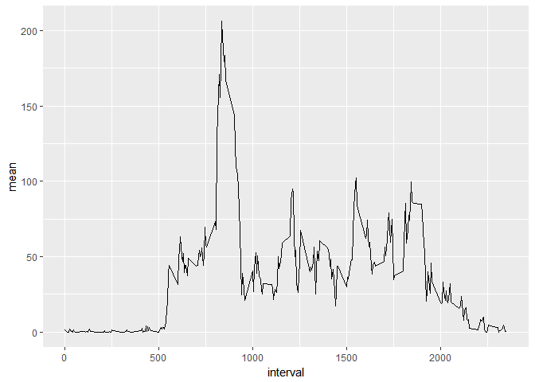

# Reproducible Research: Peer Assessment 1


## Loading and preprocessing the data


```r
data <- read.csv(unz("activity.zip", "activity.csv"))
```

## What is mean total number of steps taken per day?
In order to calculate the number of steps, we need to aggregate the steps for each day with group_by, and ignore NA values.


```r
per_day <- data %>% 
        filter(!is.na(steps)) %>% 
        group_by(date) %>% 
        summarize(sum = sum(steps))

meanSteps <- round(mean(per_day$sum), digits = 2)
medianSteps <- median(per_day$sum)

qplot(sum, data = per_day, bins = 20, xlab = "Number of steps", ylab = "Frequency", main = "Total number of steps taken each day")
```


The mean number of steps each day is 10766.19 and the median is 10765.


## What is the average daily activity pattern?  
Plotting the interval on the x-axis and the average number of steps taken, averaged across all days for the y-axis.  

```r
intervalsWithSteps <- data %>% 
        filter(!is.na(steps)) %>% 
        group_by(interval) %>% 
        summarize(sum = sum(steps), mean = mean(steps))

maxSteps <- intervalsWithSteps[which.max(intervalsWithSteps$sum),2]

qplot(interval, mean, data = intervalsWithSteps, geom = "line")
```



The interval with the highest average steps is 10927 which corresponds to 104 steps.

## Imputing missing values
In this part, we will identify the number of missing values and then define a strategy to fill them in with similar data.  


```r
numberNA <- sum(is.na(data$steps))
```

The total number of missing values are: 2304
In order to replace them we use the mean for that 5-minute interval gained from intervalsWithSteps and reuse code from question 1.  


```r
per_day_with_more_data <- data %>% 
        left_join(intervalsWithSteps, by = "interval") %>%
        mutate(steps = ifelse(is.na(steps), mean, steps)) %>%
        group_by(date) %>% 
        summarize(sum = sum(steps))

qplot(sum, data = per_day_with_more_data, bins = 20, xlab = "Number of steps", ylab = "Frequency", main = "Total number of steps taken each day")
```


```r
absDiffmeanSteps <- abs(meanSteps - round(mean(per_day$sum), digits = 2))
absDiffmedianSteps <- abs(median(per_day_with_more_data$sum) - median(per_day$sum))
```

The mean number of steps each day is 10766.19 and the median is 10765.
The absolute difference between the mean and median are 0 and 1.19.

## Are there differences in activity patterns between weekdays and weekends?  
Add a column identifying weekday or weekend with strftime(data$date, "%u").
Plot this as question two and differentiate between the days.


```r
per_day_with_more_data <- data %>% 
        left_join(intervalsWithSteps, by = "interval") %>%
        mutate(steps = ifelse(is.na(steps), mean, steps), day = as.factor(ifelse(strftime(date, format="%u") > 5, "Weekend", "Weekday"))) %>%
        group_by(day, interval) %>%
        summarize(sum = sum(steps), mean = mean(steps))

qplot(interval, mean, data = per_day_with_more_data, facets = (day ~ .), geom = "line", xlab = "Interval", ylab = "Average steps taken", main = "Difference between steps taken on weekdays and weekends")
```


